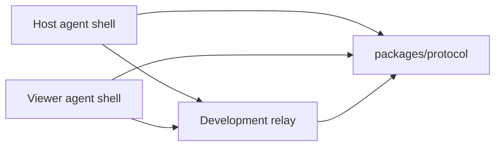

# Architecture

## Bootstrap Architecture

The bootstrap validates the session protocol and relay behavior before native Windows code exists.

## Components

### packages/protocol

Owns shared schemas for:

- Device identity.
- Pairing tickets.
- Peer roles.
- Session join messages.
- Consent decisions.
- Permission grants.
- Session authorization lifecycle.
- Relay signaling.
- Peer disconnect notices.
- Session control.
- Audit events.

The protocol package is the compatibility contract between host, viewer, relay, and future native adapters.
Protocol-facing machine identifiers are bounded and restricted to a safe printable profile before they can be used in relay state, authorization records, pairing records, or audit-related protocol metadata.

Preferred future clients should use the session authorization protocol messages for consent-bound lifecycle work:

- `session-authorization-request`
- `session-authorization-decision`
- `session-authorization-state`
- `session-control`
- `permission-revoked`
- `peer-disconnected`

These messages are wire contracts only. Sensitive actions still require the shared session authorization state-machine checks.
Session controls are authorization-bound: pause, resume, terminate, and permission-revoke control intent carries the affected `authorizationId` and cannot stand in for an action grant by itself.

### packages/audit-log

Owns reusable development audit sinks:

- In-memory sink for tests.
- Console JSON-lines sink for local debugging.
- File JSON-lines sink for local persistent development audit records.
- Schema validation and redaction through protocol audit contracts.

In-memory audit records are immutable after write so test code cannot mutate retained audit history.
Audit detail metadata is restricted to JSON-compatible values before records or protocol `audit-event` messages are retained, emitted, encoded, or persisted; properties that JSON would silently omit and detail keys containing ASCII control or Unicode bidi/zero-width formatting controls are rejected.
Audit output must not contain raw tokens, raw pairing codes, credentials, API keys, authorization headers, cookies, private keys, raw display names, private reason text, keystrokes, screenshots, screen contents, clipboard contents, file-transfer contents/data/bytes, or diagnostics content/dumps.
Audit detail redaction preserves non-secret lifecycle identifiers such as `authorizationId`.

### apps/relay

Provides a development WebSocket relay:

- Starts through a managed runtime with explicit `start()` and `stop()` lifecycle.
- Emits the accepted development-mode startup audit only after the listener successfully binds, and rejects duplicate active `start()` calls before another listener attempt, warning, or startup audit write.
- Validates environment-derived and injected local TCP ports before opening the listener.
- Accepts host/viewer peers.
- Requires session id, peer id, role, and pairing credential.
- Creates a salted hashed expiring pairing ticket when the host joins, then requires a distinct viewer device to consume that ticket before room registration and records paired-device metadata only within the ticket validity window.
- Optionally enforces a non-blank, already trimmed, bounded shared development token with no ASCII control or Unicode bidi/zero-width formatting controls by requiring exactly one matching canonical lowercase `token` query parameter before room registration; missing, duplicate, case-variant, padded, or wrong token parameters fail closed, and when no shared token is configured, token-bearing client URLs are rejected before room registration instead of being silently accepted.
- Limits a room to one host and one viewer.
- Treats live peer ids as exclusive within a session room; duplicate joins for an already registered peer id are rejected before replacing the peer send path or mutating pairing-ticket state. The same peer id can join again only after normal disconnect cleanup removes the previous peer.
- Validates protocol envelopes before forwarding.
- Binds registered-peer forwarding to the socket's peer id and rejects join-only, relay-originated, spoofed sender/actor, or role-mismatched authorization messages.
- Requires host role before forwarding host-originated legacy consent decisions and host-only workflow authority messages such as authorization state, permission revocation, session control, and development workflow audit events.
- Requires a remaining registered recipient and rejects explicit target peer ids that do not match that recipient.
- Rejects `hello` capability hints that are blank, untrimmed, duplicated after trimming, or contain ASCII control or Unicode bidi/zero-width formatting controls before accepting them as peer metadata.
- Rejects malformed protocol identifiers before relay room registration.
- Bounds raw WebSocket message size before protocol decoding.
- Requires every `signal` payload to be a JSON-compatible object with a valid top-level `authorizationId` and property names without ASCII control or Unicode bidi/zero-width formatting controls before forwarding, then rejects empty, oversized, non-representable, inherited-`toJSON`-mutated, or sensitive-key payloads including auth/session secret key names plus clipboard, file-transfer, and diagnostics content key names.
- Normalizes malformed-message `relay-error` and invalid-message audit reasons to bounded secret-safe strings.
- Emits structured development audit records for joins, denials, forwarding, and disconnects; decoded denied joins include safe attempted session and peer attribution, omitting raw attempted identifiers when they contain the submitted pairing code. Accepted forwarding audit includes the validated `messageId` plus safe recipient peer metadata, and accepted signal-forwarding audit also includes the non-secret `authorizationId` but not raw signal payload contents.
- Redacts or omits audit attribution for protocol identifiers that contain pairing codes or obvious token, credential, cookie, or key secret-marker families, including marker words separated by `.`, `_`, `-`, or `:`.
- Rate-limits repeated invalid token and malformed-message attempts with in-memory development defaults and bounded canonical integer environment overrides.
- Sends WebSocket heartbeat pings, closes peers that miss heartbeat timeout, and audits heartbeat timeout failures.
- Sends schema-valid `peer-disconnected` notices to the remaining peer when a registered host or viewer disconnects.
- Rejects peer-originated `peer-disconnected` messages before forwarding because disconnect notices are broker-observed relay lifecycle events.

This relay is not production authorization. A future identity/auth OpenSpec change must add proper accounts, token lifecycle, device trust, and audit persistence.
Production abuse protection also needs a distributed limiter or edge protection; the current limiter is single-process development hardening.
Production liveness also needs distributed state, reconnect policy, and stale-session cleanup beyond this single-process development heartbeat.
Peer disconnect notices are lifecycle notifications only. They do not grant permissions, start capture, send input, reconnect peers, or bypass authorization.

The CLI entrypoint and integration tests use the same runtime implementation. Tests start the relay on an ephemeral local port and verify real WebSocket join, forwarding, rejection, disconnect notification, and rate-limit behavior.
Unexpected relay CLI startup/shutdown errors are printed as metadata-only diagnostics with generic text and message byte length, not raw exception messages or stacks.

Set `WINBRIDGE_RELAY_AUDIT_LOG_PATH` to write relay audit events to a local JSONL file during development; configured audit paths must be non-blank, already trimmed, 1024 UTF-8 bytes or less, contain no ASCII control characters, and contain no Unicode bidi/zero-width formatting controls.
Heartbeat defaults are controlled by `WINBRIDGE_RELAY_HEARTBEAT_ENABLED`, `WINBRIDGE_RELAY_HEARTBEAT_INTERVAL_MS`, and `WINBRIDGE_RELAY_HEARTBEAT_TIMEOUT_MS`; the enabled flag must use a canonical value without leading or trailing whitespace.
Pairing ticket defaults are controlled by `WINBRIDGE_RELAY_PAIRING_TICKET_TTL_MS` and `WINBRIDGE_RELAY_PAIRING_TICKET_MAX_USES`; injected runtime pairing settings are bounded before host pairing tickets are created.

### apps/agent-shell

Provides a CLI exerciser for protocol and relay behavior. It intentionally does not capture screens, inject input, sync clipboard, transfer files, or install a service.

Clipboard permissions `clipboard:read` and `clipboard:write` are intentionally rejected by shared protocol, authorization, CLI, and runtime validation until a dedicated OpenSpec change and security review define a consent-first clipboard capability.

File transfer permission `file-transfer` is intentionally rejected by shared protocol, authorization, CLI, host control, and runtime validation until a dedicated OpenSpec change and security review define a consent-first file-transfer capability.

Diagnostics-shaped permission `diagnostics:view` is intentionally rejected by shared protocol, authorization, CLI, host control, and runtime validation until a dedicated OpenSpec change and security review define a consent-first diagnostics capability.

The shell has a managed runtime shared by CLI and tests. Development consent workflow behavior:

- The runtime rejects duplicate active `start()` calls before opening another WebSocket or sending another join, while allowing explicit restart after the previous connection is fully closed or stopped.
- The runtime sends `join-session` on socket open and defers `hello` until the relay reports a two-peer room or a peer `hello` is received.
- Viewer mode can send `session-authorization-request` when explicit viewer-only `--request` permissions are provided and the relay has reported a paired two-peer room.
- Host mode rejects explicit `--request` before managed runtime creation; direct host runtimes reject non-empty `requestedPermissions` before opening a relay connection.
- Host mode does nothing by default when a request is received.
- Host mode can send approval or denial only with explicit static `--host-decision` or opt-in interactive `--host-consent-prompt true`.
- Host approval can use explicit development `--grant <permission[,permission]>` scope only to narrow the viewer's current request. The grant scope is host-only, non-empty, unique, valid only with static approval or interactive host consent, and fails closed without approval, active-state, control, signal, or workflow audit messages if it contains an unrequested permission.
- Interactive host consent prompts show the observed viewer peer id, validated viewer display name when available, requested permission names, and permission count before accepting input; they accept only exact `approve` or `deny` responses before the bounded host consent timeout expires, are mutually exclusive with static approval/denial, and fail closed on timeout, invalid input, cancellation, or prompt failure. The displayed viewer identity is development peer metadata, not production account authentication.
- Interactive host control prompt mode is an opt-in development CLI surface that accepts exact host commands `help`, `status`, `pause`, `resume`, `revoke <permission>`, `terminate`, and `disconnect`; it is host-only, mutually exclusive with interactive host consent prompt mode and one-shot host status mode, never echoes raw command lines, prints only a static command list for `help`, calls only the managed runtime direct controls for lifecycle commands, uses a read-only runtime snapshot for `status`, and stops the prompt locally after successful `terminate` or `disconnect` while keeping failed terminal or disconnect attempts recoverable through sanitized error output.
- Host runtimes expose a read-only bounded status snapshot for future host UI wiring; it reports local indicator lifecycle metadata only and does not send protocol messages, emit workflow audit events, grant permissions, start signaling, reconnect peers, or invoke host controls. The development CLI can print this snapshot once with `--host-status-after-ms <delay>` after host-only bounded-delay validation, or repeatedly through the host control prompt `status` command. The one-shot helper runs inside the ordinary managed runtime, so normal startup and other explicit host workflow options keep their existing protocol behavior; the scheduled status read itself remains read-only.
- Viewer runtimes expose a read-only bounded status snapshot for future viewer UI wiring; it reports local lifecycle metadata only and does not send protocol messages, emit workflow audit events, grant permissions, start signaling, or invoke host controls. After trusted host disconnect, viewer status reports inactive local state with zero action-capable permissions while retaining optional authorization id/status metadata for local diagnostics. After managed local viewer leave, viewer status reports inactive local state with zero action-capable permissions and clears authorization id/status metadata from the left connection scope. The development CLI can print this snapshot once with `--viewer-status-after-ms <delay>` after viewer-only bounded-delay validation, or repeatedly through viewer-only `--viewer-control-prompt true`.
- Viewer runtimes can schedule a local development leave with `--viewer-disconnect-after-ms <delay>`; it invokes the managed viewer-only `leave()` control, closes only the local viewer relay connection, sends no forged `peer-disconnected`, lifecycle, signal, control, or workflow audit messages, and relies on the relay to notify the remaining host.
- Viewer control prompt mode is an opt-in development CLI surface that accepts exact viewer commands `help`, `status`, and `disconnect`; it is viewer-only, mutually exclusive with the one-shot viewer status and disconnect timers, never echoes raw command lines, prints only a static command list for `help`, uses the read-only runtime snapshot for `status`, uses the managed viewer-only `leave()` control for `disconnect`, stops the prompt locally after successful `disconnect`, and keeps failed disconnect attempts recoverable through sanitized error output.
- Viewer signal probe mode is an opt-in development signaling surface that sends one static `signal` payload after the viewer observes active visible `screen:view` authorization; it is viewer-only, requires a `screen:view` request, uses the public runtime signal send gates, and carries no SDP, ICE candidates, user-provided JSON, screen contents, input, clipboard data, file-transfer data, diagnostics data, tokens, pairing codes, or display names.
- Host signal probe acknowledgement mode is an opt-in development signaling surface that sends at most one static acknowledgement `signal` per authorization id after a trusted viewer probe passes inbound signal gates; it is host-only, uses the public runtime signal send gates, fails closed after pause, revoke, termination, expiration, local disconnect, remote disconnect, missing recipient, routing mismatch, invisible approval, or missing `screen:view`, and carries no SDP, ICE candidates, user-provided JSON, screen contents, input, clipboard data, file-transfer data, diagnostics data, tokens, pairing codes, credentials, private reasons, or display names.
- Host mode emits active state only when `--visible-session true` is also provided.
- Viewer mode rejects explicit host-only workflow CLI options before runtime startup, including static host decisions, host consent prompt settings, host visibility flags, authorization TTL, host grants, host lifecycle timers/reasons, host status/control options, and host signal acknowledgement, even when the explicit value is a no-op such as `none` or `false`.
- Inbound `relay-ready` messages whose peer id does not match the local runtime peer are ignored before local received-event emission or presence and authorization request workflow handling.
- Inbound `hello` messages whose peer id matches the local runtime peer are ignored before local received-event emission or presence workflow handling.
- Inbound protocol messages whose session id does not match the local runtime session are ignored before local received-event emission or consent workflow handling.
- Inbound authorization requests that identify the local host peer as the viewer are ignored before local received-event emission or consent workflow handling.
- CLI argument parsing rejects unknown, duplicate, missing-value, malformed relay URL, relay URLs with embedded credentials or canonical/case-variant `token` query values, malformed protocol identifier, blank, untrimmed, control-character, bidi/zero-width-control, or oversized display name, malformed or unavailable permissions including clipboard, file-transfer, and diagnostics-shaped permissions, malformed pairing, blank, untrimmed, control-character, bidi/zero-width-control, or oversized token, zero or unsafe `--authorization-ttl-ms`, zero, unsafe, or prompt-disabled `--host-consent-timeout-ms`, blank, untrimmed, control-character, bidi/zero-width-control, or oversized audit log path, blank, untrimmed, or oversized lifecycle reason, WebSocket-close-unsafe or viewer-mode host disconnect reason, non-`true`/`false` visible-session, host-consent-prompt, host-control-prompt, viewer-control-prompt, or host-signal-probe-ack values, explicit host workflow options on viewer runtimes, explicit viewer request options on host runtimes, viewer prompt mode, host control prompt mode on viewers, viewer control prompt mode on hosts, host signal probe acknowledgement mode on viewers, malformed or ambiguous host grant scope, host consent prompt combined with static approval/denial, host control prompt combined with host consent prompt or one-shot host status, viewer control prompt combined with one-shot viewer status or disconnect timers, malformed or viewer-mode one-shot host status, malformed, host-mode, or `screen:view`-less viewer signal probe configuration, malformed or host-mode viewer status configuration, and malformed or host-mode viewer local disconnect configuration before runtime start.
- The managed runtime also rejects malformed direct options before relay startup, including non-WebSocket relay URLs, relay URLs with embedded credentials or canonical/case-variant `token` query values, malformed identifiers, blank, untrimmed, control-character, bidi/zero-width-control, or oversized display names, blank, untrimmed, control-character, bidi/zero-width-control, non-string, or oversized tokens, duplicate, invalid, or unavailable permissions including clipboard, file-transfer, and diagnostics-shaped permissions, non-empty host requested permissions, malformed host grant scope, non-boolean visible-session flags, viewer runtime host workflow state, invalid host decision providers, host decision providers on viewer runtimes, host decision providers combined with static approval/denial, providerless, zero, or unsafe host consent timeout, zero or unsafe authorization TTL, unsafe workflow timers, malformed viewer signal probe configuration, malformed or viewer-mode host signal probe acknowledgement configuration, blank, untrimmed, or oversized decision/lifecycle reasons, and WebSocket-close-unsafe or viewer-mode host disconnect reasons. Empty host requested permissions remain a non-authorizing compatibility default. Relay shared tokens use the dedicated `--token`/runtime token path and are bounded before connection setup.
- Host mode can simulate permission revocation only after explicit visible approval with `--revoke-after-ms` and `--revoke-permission`; managed host runtimes can also invoke direct local `revokePermission(permission)` after active or paused visible authorization for a currently granted permission. Direct and delayed revocation share the same host workflow state, protocol sequence, indicator updates, and audit-first behavior.
- Host mode can simulate session termination only after explicit visible approval with `--terminate-after-ms`; managed host runtimes can also invoke direct local `terminate()` after active or paused visible authorization. Direct and delayed termination share the same host workflow state, protocol sequence, inactive indicator update, and audit-first behavior.
- Host mode can simulate authorization expiration after visible activation with positive `--authorization-ttl-ms`.
- Host mode can simulate pause/resume only after explicit visible approval with `--pause-after-ms` and optional `--resume-after-ms`; managed host runtimes can also invoke direct local `pause()` after active visible authorization and direct local `resume()` after paused visible authorization. Direct and delayed pause/resume share the same host workflow state, protocol sequence, indicator updates, and audit-first behavior.
- Host mode can simulate local disconnect only after explicit visible approval with `--disconnect-after-ms`; managed host runtimes can also invoke direct local disconnect control after active or paused visible authorization. Both paths can use an optional bounded host disconnect reason only as local WebSocket close metadata, close the host relay WebSocket, and leave the relay responsible for `peer-disconnected` notices.
- Host mode emits local secret-safe `indicator` runtime events for visible-session UI wiring after explicit visible activation, updates them for pause/resume/permission changes, and deactivates them on terminal lifecycle, disconnect, runtime stop, or socket close. Indicator events do not authorize remote actions.
- Host mode emits development `audit-event` protocol messages for decision, activation, revocation, termination, expiration, pause, and resume workflow events.
- Host mode can persist those host-generated workflow audit events and local disconnect audit records to JSONL with `--audit-log` or `WINBRIDGE_AGENT_AUDIT_LOG_PATH`; configured audit paths must be non-blank, already trimmed, 1024 UTF-8 bytes or less, contain no ASCII control characters, and contain no Unicode bidi or zero-width formatting controls. Revocation, termination, and pause/resume audit failures are reported with sanitized diagnostics and block the matching lifecycle protocol messages. Local disconnect audit failures are reported with sanitized diagnostics but do not block indicator deactivation or WebSocket close.
- Host mode records `peer-disconnected` as remote peer disconnected state and suppresses later delayed workflow simulation messages and direct managed runtime sends for that peer.
- Host mode suppresses later delayed workflow simulation messages after local disconnect simulation closes the connection.
- Inbound `peer-disconnected` messages whose peer id matches the local runtime peer are ignored before local received-event emission or remote peer disconnected state handling.
- Runtime `sent` events use schema-normalized event-safe protocol views; audit-event details and join-session pairing codes are redacted from the local event surface.
- Runtime `sent` events for `signal` messages expose routing metadata and redacted payload summaries, not raw signal payload contents.
- Viewer-originated `signal` sends fail closed unless the viewer has observed an active, visible, unexpired `screen:view` authorization state and the signal payload carries the matching `authorizationId`.
- Viewer-side authorization lifecycle state is bound to the host authority and authorization id from a decision addressed to the local viewer; inbound legacy consent decisions plus unbound, mismatched-authority, mismatched-authorization, denied-to-active, terminal same-id decision replay, or prior-connection state/control/revoke messages are ignored before received-event emission and cannot unlock `signal` sends. Bound revoke controls remove permission locally before the follow-up `permission-revoked` confirmation and state update. Same-authorization stale decisions or state updates are filtered through a local revoked-permission floor so they cannot restore `screen:view`; a new authorization id from the observed host resets that floor for the new consent scope.
- Runtime `received` events for `signal` messages expose routing metadata and redacted payload summaries, not raw signal payload contents.
- Inbound `signal` messages are ignored before local received-event emission unless the runtime has active visible `screen:view` authorization and the signal payload carries the matching `authorizationId`.
- Host-originated public runtime `signal` sends fail closed before socket write and local sent-event emission unless the host has locally emitted an active, visible, unexpired `screen:view` authorization state and the signal payload carries the matching `authorizationId`.
- Public and inbound `signal` payload validation rejects unsafe property names containing ASCII control or Unicode bidi/zero-width formatting controls before trusted events or socket writes, and diagnostics remain redacted from raw key names and values.
- Public runtime sends for workflow-authority messages (`host-consent-decision`, `session-authorization-decision`, `session-authorization-state`, `permission-revoked`, `session-control`, and `audit-event`) fail closed before socket write and local sent-event emission; only the internal explicit consent workflow emits those messages. Legacy `host-consent-required` remains a non-granting request message.
- Inbound `signal` messages are ignored before local received-event emission unless they are addressed to the local runtime peer and originate from a distinct remote peer.
- Inbound legacy consent decisions, authorization lifecycle messages, and audit workflow messages that identify the local runtime peer as the authority actor are ignored before local received-event emission or workflow summary logging.
- Runtime `sent` and `received` events redact protocol `reason` text while preserving consent workflow metadata.
- Runtime `raw` events for non-protocol inbound text are metadata-only; they expose redacted text and byte length, not the original payload.
- Runtime `closed` events for WebSocket disconnects are metadata-only; they expose redacted reason text and reason byte length, not the original close reason.
- Runtime `error` events and runtime/socket error logs are metadata-only; they expose generic error text and message byte length, not raw exception messages.
- Received message logs contain summaries only, not raw protocol payloads.
- CLI argument parsing rejects duplicate requested permissions before sending authorization requests.
- Unexpected CLI startup/shutdown errors are metadata-only; expected usage errors remain static usage text.

This workflow is a protocol simulator, not production host consent UI.
Development agent-shell audit files are local development persistence, not production audit storage.
Agent-shell `hello` messages are presence metadata only. They do not authorize sessions, activate visibility, grant permissions, or enable remote actions.

## Future Windows Architecture

Future native work should be split into separate OpenSpec changes:

- Host UI and session indicator.
- Viewer UI.
- Windows screen capture adapter.
- Windows input adapter.
- WebRTC media transport.
- Identity and device pairing.
- Audit persistence.
- Installer and update model.

Native code must preserve host-visible consent and revocation controls.

## Authorization Contract

Future native adapters must call the shared protocol authorization checks before processing sensitive actions. A remote action is allowed only when:

- The session authorization state is `active`.
- The host-visible session flag is true.
- The authorization has not expired.
- The requested permission is present.
- The session is not paused, revoked, or terminated.

Permission revocation must also use the shared authorization state machine. It is valid only for visible, unexpired `active` or `paused` authorizations with the permission currently granted; partial revocation preserves pause state, and final revocation marks the authorization `revoked`.

Approval grants must also be created through the shared state machine. Host approval may grant an exact or narrower subset of the viewer's requested permissions, but empty, duplicate, or unrequested grants are rejected before activation.
Terminal authorization states such as `denied`, `revoked`, `terminated`, and `expired` carry no permissions, preventing stale grant scope from being interpreted by future native adapters. Native adapters must also treat viewer-observed same-authorization permission revocations as a floor that stale lifecycle messages cannot widen, and must ignore later approved decisions replayed for the same terminal authorization id. A new authorization id from the observed host must be evaluated as a new consent scope, not constrained by the previous authorization id's floor.
