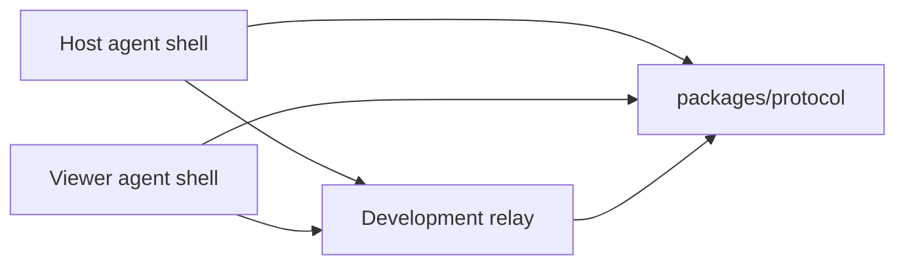

# Architecture

## Bootstrap Architecture

The bootstrap validates the session protocol and relay behavior before native Windows code exists.

## Components

### packages/protocol

Owns shared schemas for:

- Device identity.
- Pairing tickets.
- Peer roles.
- Session join messages.
- Consent decisions.
- Permission grants.
- Session authorization lifecycle.
- Relay signaling.
- Session control.
- Audit events.

The protocol package is the compatibility contract between host, viewer, relay, and future native adapters.

Preferred future clients should use the session authorization protocol messages for consent-bound lifecycle work:

- `session-authorization-request`
- `session-authorization-decision`
- `session-authorization-state`
- `permission-revoked`

These messages are wire contracts only. Sensitive actions still require the shared session authorization state-machine checks.

### packages/audit-log

Owns reusable development audit sinks:

- In-memory sink for tests.
- Console JSON-lines sink for local debugging.
- File JSON-lines sink for local persistent development audit records.
- Schema validation and redaction through protocol audit contracts.

Audit output must not contain raw tokens, raw pairing codes, credentials, keystrokes, screenshots, or screen contents.

### apps/relay

Provides a development WebSocket relay:

- Starts through a managed runtime with explicit `start()` and `stop()` lifecycle.
- Accepts host/viewer peers.
- Requires session id, peer id, role, and pairing credential.
- Optionally enforces a shared development token.
- Limits a room to one host and one viewer.
- Validates protocol envelopes before forwarding.
- Emits structured development audit records for joins, denials, forwarding, and disconnects.
- Rate-limits repeated invalid token and malformed-message attempts with in-memory development defaults.
- Sends WebSocket heartbeat pings, closes peers that miss heartbeat timeout, and audits heartbeat timeout failures.

This relay is not production authorization. A future identity/auth OpenSpec change must add proper accounts, token lifecycle, device trust, and audit persistence.
Production abuse protection also needs a distributed limiter or edge protection; the current limiter is single-process development hardening.
Production liveness also needs distributed state, reconnect policy, and stale-session cleanup beyond this single-process development heartbeat.

The CLI entrypoint and integration tests use the same runtime implementation. Tests start the relay on an ephemeral local port and verify real WebSocket join, forwarding, rejection, and rate-limit behavior.

Set `WINBRIDGE_RELAY_AUDIT_LOG_PATH` to write relay audit events to a local JSONL file during development.
Heartbeat defaults are controlled by `WINBRIDGE_RELAY_HEARTBEAT_ENABLED`, `WINBRIDGE_RELAY_HEARTBEAT_INTERVAL_MS`, and `WINBRIDGE_RELAY_HEARTBEAT_TIMEOUT_MS`.

### apps/agent-shell

Provides a CLI exerciser for protocol and relay behavior. It intentionally does not capture screens, inject input, sync clipboard, transfer files, or install a service.

The shell has a managed runtime shared by CLI and tests. Development consent workflow behavior:

- Viewer mode can send `session-authorization-request` when explicit `--request` permissions are provided.
- Host mode does nothing by default when a request is received.
- Host mode can send approval or denial only with explicit `--host-decision`.
- Host mode emits active state only when `--visible-session true` is also provided.

This workflow is a protocol simulator, not production host consent UI.

## Future Windows Architecture

Future native work should be split into separate OpenSpec changes:

- Host UI and session indicator.
- Viewer UI.
- Windows screen capture adapter.
- Windows input adapter.
- WebRTC media transport.
- Identity and device pairing.
- Audit persistence.
- Installer and update model.

Native code must preserve host-visible consent and revocation controls.

## Authorization Contract

Future native adapters must call the shared protocol authorization checks before processing sensitive actions. A remote action is allowed only when:

- The session authorization state is `active`.
- The host-visible session flag is true.
- The authorization has not expired.
- The requested permission is present.
- The session has not been revoked or terminated.
