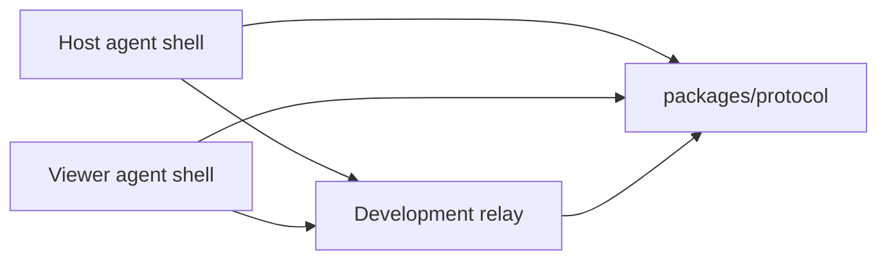

# Architecture

## Bootstrap Architecture

The bootstrap validates the session protocol and relay behavior before native Windows code exists.

## Components

### packages/protocol

Owns shared schemas for:

- Device identity.
- Pairing tickets.
- Peer roles.
- Session join messages.
- Consent decisions.
- Permission grants.
- Session authorization lifecycle.
- Relay signaling.
- Peer disconnect notices.
- Session control.
- Audit events.

The protocol package is the compatibility contract between host, viewer, relay, and future native adapters.
Protocol-facing machine identifiers are bounded and restricted to a safe printable profile before they can be used in relay state, authorization records, pairing records, or audit-related protocol metadata.

Preferred future clients should use the session authorization protocol messages for consent-bound lifecycle work:

- `session-authorization-request`
- `session-authorization-decision`
- `session-authorization-state`
- `session-control`
- `permission-revoked`
- `peer-disconnected`

These messages are wire contracts only. Sensitive actions still require the shared session authorization state-machine checks.
Session controls are authorization-bound: pause, resume, terminate, and permission-revoke control intent carries the affected `authorizationId` and cannot stand in for an action grant by itself.

### packages/audit-log

Owns reusable development audit sinks:

- In-memory sink for tests.
- Console JSON-lines sink for local debugging.
- File JSON-lines sink for local persistent development audit records.
- Schema validation and redaction through protocol audit contracts.

Audit output must not contain raw tokens, raw pairing codes, credentials, API keys, authorization headers, cookies, private keys, keystrokes, screenshots, screen contents, clipboard contents, file-transfer contents/data/bytes, or diagnostics content/dumps.
Audit detail redaction preserves non-secret lifecycle identifiers such as `authorizationId`.

### apps/relay

Provides a development WebSocket relay:

- Starts through a managed runtime with explicit `start()` and `stop()` lifecycle.
- Validates environment-derived and injected local TCP ports before opening the listener.
- Accepts host/viewer peers.
- Requires session id, peer id, role, and pairing credential.
- Creates a salted hashed expiring pairing ticket when the host joins, then requires the viewer to consume that ticket before room registration.
- Optionally enforces a shared development token by requiring exactly one matching `token` query parameter before room registration; when no shared token is configured, token-bearing client URLs are rejected before room registration instead of being silently accepted.
- Limits a room to one host and one viewer.
- Treats live peer ids as exclusive within a session room; duplicate joins for an already registered peer id are rejected before replacing the peer send path or mutating pairing-ticket state. The same peer id can join again only after normal disconnect cleanup removes the previous peer.
- Validates protocol envelopes before forwarding.
- Binds registered-peer forwarding to the socket's peer id and rejects join-only, relay-originated, spoofed sender/actor, or role-mismatched authorization messages.
- Requires host role before forwarding host-originated legacy consent decisions and host-only workflow authority messages such as authorization state, permission revocation, session control, and development workflow audit events.
- Requires a remaining registered recipient and rejects explicit target peer ids that do not match that recipient.
- Rejects malformed protocol identifiers before relay room registration.
- Bounds raw WebSocket message size before protocol decoding.
- Requires every `signal` payload to carry a valid top-level `authorizationId` before forwarding, then rejects empty, oversized, or sensitive-key payloads including auth/session secret key names plus clipboard, file-transfer, and diagnostics content key names.
- Normalizes malformed-message `relay-error` and invalid-message audit reasons to bounded secret-safe strings.
- Emits structured development audit records for joins, denials, forwarding, and disconnects; accepted forwarding audit includes the validated `messageId` plus safe recipient peer metadata, and accepted signal-forwarding audit also includes the non-secret `authorizationId` but not raw signal payload contents.
- Rate-limits repeated invalid token and malformed-message attempts with in-memory development defaults.
- Sends WebSocket heartbeat pings, closes peers that miss heartbeat timeout, and audits heartbeat timeout failures.
- Sends schema-valid `peer-disconnected` notices to the remaining peer when a registered host or viewer disconnects.
- Rejects peer-originated `peer-disconnected` messages before forwarding because disconnect notices are broker-observed relay lifecycle events.

This relay is not production authorization. A future identity/auth OpenSpec change must add proper accounts, token lifecycle, device trust, and audit persistence.
Production abuse protection also needs a distributed limiter or edge protection; the current limiter is single-process development hardening.
Production liveness also needs distributed state, reconnect policy, and stale-session cleanup beyond this single-process development heartbeat.
Peer disconnect notices are lifecycle notifications only. They do not grant permissions, start capture, send input, reconnect peers, or bypass authorization.

The CLI entrypoint and integration tests use the same runtime implementation. Tests start the relay on an ephemeral local port and verify real WebSocket join, forwarding, rejection, disconnect notification, and rate-limit behavior.
Unexpected relay CLI startup/shutdown errors are printed as metadata-only diagnostics with generic text and message byte length, not raw exception messages or stacks.

Set `WINBRIDGE_RELAY_AUDIT_LOG_PATH` to write relay audit events to a local JSONL file during development.
Heartbeat defaults are controlled by `WINBRIDGE_RELAY_HEARTBEAT_ENABLED`, `WINBRIDGE_RELAY_HEARTBEAT_INTERVAL_MS`, and `WINBRIDGE_RELAY_HEARTBEAT_TIMEOUT_MS`.
Pairing ticket defaults are controlled by `WINBRIDGE_RELAY_PAIRING_TICKET_TTL_MS` and `WINBRIDGE_RELAY_PAIRING_TICKET_MAX_USES`; injected runtime pairing settings are bounded before host pairing tickets are created.

### apps/agent-shell

Provides a CLI exerciser for protocol and relay behavior. It intentionally does not capture screens, inject input, sync clipboard, transfer files, or install a service.

The shell has a managed runtime shared by CLI and tests. Development consent workflow behavior:

- The runtime sends `join-session` on socket open and defers `hello` until the relay reports a two-peer room or a peer `hello` is received.
- Viewer mode can send `session-authorization-request` when explicit `--request` permissions are provided and the relay has reported a paired two-peer room.
- Host mode does nothing by default when a request is received.
- Host mode can send approval or denial only with explicit `--host-decision`.
- Host mode emits active state only when `--visible-session true` is also provided.
- Inbound `relay-ready` messages whose peer id does not match the local runtime peer are ignored before local received-event emission or presence and authorization request workflow handling.
- Inbound `hello` messages whose peer id matches the local runtime peer are ignored before local received-event emission or presence workflow handling.
- Inbound protocol messages whose session id does not match the local runtime session are ignored before local received-event emission or consent workflow handling.
- Inbound authorization requests that identify the local host peer as the viewer are ignored before local received-event emission or consent workflow handling.
- CLI argument parsing rejects unknown, duplicate, missing-value, malformed relay URL, relay URLs with embedded credentials or `token` query values, malformed protocol identifier, malformed permission, malformed pairing, malformed lifecycle reason, and non-`true`/`false` visible-session values before runtime start.
- The managed runtime also rejects malformed direct options before relay startup, including non-WebSocket relay URLs, relay URLs with embedded credentials or `token` query values, malformed identifiers, malformed tokens, duplicate or invalid permissions, non-boolean visible-session flags, unsafe workflow timers, and blank or oversized decision/lifecycle reasons. Relay shared tokens use the dedicated `--token`/runtime token path and are bounded before connection setup.
- Host mode can simulate permission revocation only after explicit visible approval with `--revoke-after-ms` and `--revoke-permission`.
- Host mode can simulate session termination only after explicit visible approval with `--terminate-after-ms`.
- Host mode can simulate authorization expiration after visible activation with `--authorization-ttl-ms`.
- Host mode can simulate pause/resume only after explicit visible approval with `--pause-after-ms` and optional `--resume-after-ms`.
- Host mode can simulate local disconnect only after explicit visible approval with `--disconnect-after-ms`; the host closes its relay WebSocket and the relay remains responsible for `peer-disconnected` notices.
- Host mode emits local secret-safe `indicator` runtime events for visible-session UI wiring after explicit visible activation, updates them for pause/resume/permission changes, and deactivates them on terminal lifecycle, disconnect, runtime stop, or socket close. Indicator events do not authorize remote actions.
- Host mode emits development `audit-event` protocol messages for decision, activation, revocation, termination, expiration, pause, and resume workflow events.
- Host mode can persist those host-generated workflow audit events to JSONL with `--audit-log` or `WINBRIDGE_AGENT_AUDIT_LOG_PATH`.
- Host mode records `peer-disconnected` as remote peer disconnected state and suppresses later delayed workflow simulation messages and direct managed runtime sends for that peer.
- Host mode suppresses later delayed workflow simulation messages after local disconnect simulation closes the connection.
- Inbound `peer-disconnected` messages whose peer id matches the local runtime peer are ignored before local received-event emission or remote peer disconnected state handling.
- Runtime `sent` events use schema-normalized event-safe protocol views; audit-event details and join-session pairing codes are redacted from the local event surface.
- Runtime `sent` events for `signal` messages expose routing metadata and redacted payload summaries, not raw signal payload contents.
- Viewer-originated `signal` sends fail closed unless the viewer has observed an active, visible, unexpired `screen:view` authorization state and the signal payload carries the matching `authorizationId`.
- Viewer-side authorization lifecycle state is bound to the host authority and authorization id from a decision addressed to the local viewer; inbound legacy consent decisions plus unbound, mismatched-authority, mismatched-authorization, denied-to-active, or prior-connection state/control/revoke messages are ignored before received-event emission and cannot unlock `signal` sends. Bound revoke controls remove permission locally before the follow-up `permission-revoked` confirmation and state update.
- Runtime `received` events for `signal` messages expose routing metadata and redacted payload summaries, not raw signal payload contents.
- Inbound `signal` messages are ignored before local received-event emission unless the runtime has active visible `screen:view` authorization and the signal payload carries the matching `authorizationId`.
- Host-originated public runtime `signal` sends fail closed before socket write and local sent-event emission unless the host has locally emitted an active, visible, unexpired `screen:view` authorization state and the signal payload carries the matching `authorizationId`.
- Public runtime sends for workflow-authority messages (`host-consent-decision`, `session-authorization-decision`, `session-authorization-state`, `permission-revoked`, `session-control`, and `audit-event`) fail closed before socket write and local sent-event emission; only the internal explicit consent workflow emits those messages. Legacy `host-consent-required` remains a non-granting request message.
- Inbound `signal` messages are ignored before local received-event emission unless they are addressed to the local runtime peer and originate from a distinct remote peer.
- Inbound legacy consent decisions, authorization lifecycle messages, and audit workflow messages that identify the local runtime peer as the authority actor are ignored before local received-event emission or workflow summary logging.
- Runtime `sent` and `received` events redact protocol `reason` text while preserving consent workflow metadata.
- Runtime `raw` events for non-protocol inbound text are metadata-only; they expose redacted text and byte length, not the original payload.
- Runtime `closed` events for WebSocket disconnects are metadata-only; they expose redacted reason text and reason byte length, not the original close reason.
- Runtime `error` events and runtime/socket error logs are metadata-only; they expose generic error text and message byte length, not raw exception messages.
- Received message logs contain summaries only, not raw protocol payloads.
- CLI argument parsing rejects duplicate requested permissions before sending authorization requests.
- Unexpected CLI startup/shutdown errors are metadata-only; expected usage errors remain static usage text.

This workflow is a protocol simulator, not production host consent UI.
Development agent-shell audit files are local development persistence, not production audit storage.
Agent-shell `hello` messages are presence metadata only. They do not authorize sessions, activate visibility, grant permissions, or enable remote actions.

## Future Windows Architecture

Future native work should be split into separate OpenSpec changes:

- Host UI and session indicator.
- Viewer UI.
- Windows screen capture adapter.
- Windows input adapter.
- WebRTC media transport.
- Identity and device pairing.
- Audit persistence.
- Installer and update model.

Native code must preserve host-visible consent and revocation controls.

## Authorization Contract

Future native adapters must call the shared protocol authorization checks before processing sensitive actions. A remote action is allowed only when:

- The session authorization state is `active`.
- The host-visible session flag is true.
- The authorization has not expired.
- The requested permission is present.
- The session is not paused, revoked, or terminated.

Permission revocation must also use the shared authorization state machine. It is valid only for visible, unexpired `active` or `paused` authorizations with the permission currently granted; partial revocation preserves pause state, and final revocation marks the authorization `revoked`.

Approval grants must also be created through the shared state machine. Host approval may grant an exact or narrower subset of the viewer's requested permissions, but empty, duplicate, or unrequested grants are rejected before activation.
Terminal authorization states such as `denied`, `revoked`, `terminated`, and `expired` carry no permissions, preventing stale grant scope from being interpreted by future native adapters.
